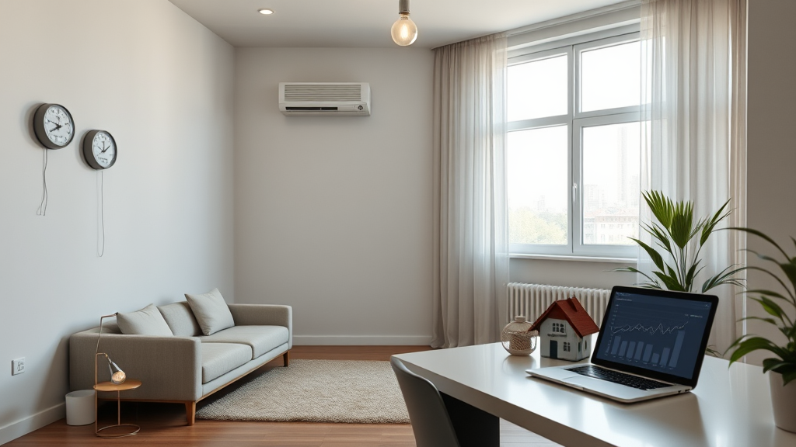

## Kiralık Ev Neden Uzun Süre Boş Kalır?

Kiralık bir evin uzun süre **boş ev maliyeti** oluşturmasının ardında sadece şans değil, bir dizi stratejik hata yatar. Ev sahipleri genellikle duygusal bağ kurdukları evlere aşırı değer biçer ve bu da fiyatlandırma hatalarına neden olur. Bir evin piyasada uzun süre talep görmemesi, genellikle yanlış fiyatlandırma, yetersiz pazarlama veya fiziksel kusurlarla ilişkilidir. Yüksek fiyat etiketi, potansiyel kiracıların ilana tıklamasını bile engelleyebilir. Boyası dökülmüş veya tesisatı bozuk bir ev, ne kadar ucuz olursa olsun, güven vermez. Bu nedenle, evin fiziksel durumu ve fiyat stratejisi gibi unsurlar, kiralık evin uzun süre boş kalmasının temel nedenlerinden biri olabilir.

Evinin uzun süre boş kalmasının ardında yatan nedenlerin sadece fiyat veya fiziksel durum olmayacağını da unutmamak gerekir. Pazarlama stratejisi de oldukça büyük bir rol oynar. Evinizi doğru şekilde tanıtmadan, hedef kitleye ulaşmadan, kiracı bulmak çok zordur. Pazarlama, sadece ilan hazırlamakla sınırlı değildir; doğru kanalları seçmek, ilan metnini etkili yazmak ve görselleri profesyonel şekilde hazırlamak da bu süreçte büyük önem taşır. Bu nedenle, evi uzun süre boş bırakmaktan kaçınmak için hem fiyat hem de pazarlama stratejilerine dikkat etmek gerekir.

## Boş Ev Maliyeti Ne Kadar?

Boş bir evin sahibi, genellikle bir maliyet problemi olduğunu fark etmeden, aidat, elektrik, su, doğalgaz ve emlak vergisi gibi giderlerle karşı karşıya kalır. Özellikle lüks sitelerde aidatlar, asgari ücret seviyelerine kadar çıkabilir. Ayrıca, aboneliklerin sabit okuma ve bakım ücretleri de her ay faturaya yansır. Bu durumun üzerine yıllık emlak vergileri ve deprem sigortası primleri eklendiğinde, sadece evin varlığını sürdürmek bile ciddi bir maliyetle sonuçlanabilir. Bu nedenle, evin boş kalma süresi ne kadar uzarsa, **boş ev maliyeti** o kadar artar. Bu durum, sadece finansal bir yük değil, aynı zamanda manevi bir dert oluşturabilir.

Boş ev maliyeti sadece giderlerden ibaret değildir. Bir evin uzun süre boş kalması, enerji kaybına, bakım giderlerine ve potansiyel hasara da neden olabilir. Örneğin, sadece birkaç ay boyunca evin kullanılmaması, elektrik ve su giderlerini artırabilir. Ayrıca, hava koşullarına bağlı olarak evin çatısında su birikintisi oluşabilir, duvarlar nem alabilir ve bu da zamanla ciddi maliyetlere yol açabilir. Bu nedenle, evin boş kalma süresini azaltmak ve maliyetleri kontrol etmek için stratejik kararlar almak çok önemlidir.

## Doğru Kira Bedeli Nasıl Hesaplanır?

Evin kira bedeli, gayrimenkulün piyasadaki başarısını belirleyen en kritik unsurlardan biridir. Fiyatı çok düşük tutmak gelir kaybına, çok yüksek tutmak ise evin aylarca sahipsiz kalmasına neden olabilir. Bu nedenle, ev sahipleri, duygusal bağlarından uzaklaşmalı, tamamen matematiksel ve bölgesel emsal verilere odaklanmalıdır. Çevredeki benzer metrekare ve oda sayısına sahip evlerin piyasa hareketlerini yakından incelemek önemlidir.

Ayrıca, ulaşım ağlarına yakınlık, binanın yaşı ve asansör gibi ekstra donanımlar, kira bedelini doğrudan etkileyebilir. Sosyal medya veya gayrimenkul sitelerinde uzun süre bekleyen ilanlara bakmak, nerede hata yapıldığını net olarak gösterir. Ancak, sadece fiyat belirlemek yetmez. Evinin pazarlaması da çok önemlidir. Evinizi doğru şekilde tanıtmadan, hedef kitleye ulaşmadan, kiracı bulmak çok zordur. Pazarlama, sadece ilan hazırlamakla sınırlı değildir; doğru kanalları seçmek, ilan metnini etkili yazmak ve görselleri profesyonel şekilde hazırlamak da bu süreçte büyük önem taşır.

## Sıkça Sorulan Sorular

**Evim uzun süre boş kalıyorsa, ne yapmalıyım?**
Evinizi uzun süre boş bırakmaktan kaçınmak için, fiyat stratejisi ve pazarlama yöntemlerini gözden geçirmeniz gerekir. Profesyonel bir şekilde ilan hazırlayarak ve doğru fiyat belirleyerek, evinizi daha hızlı kiralamak mümkün olur.

**Boş ev maliyeti ne kadar olabilir?**
Boş bir evin maliyeti, aidat, elektrik, su, doğalgaz ve emlak vergileri gibi unsurlarla beraber aylık olarak binlerce liralık bir maliyet oluşturabilir. Bu nedenle, uzun süre boş kalan evler, sahipleri için büyük bir yük olabilir.

**Kiralık evi ne kadar süre boş bırakmak mantıklı olur?**
Kiralık evi 3-6 ayın üzerinde boş bırakmak, genellikle maliyetler açısından olumsuz sonuçlar doğurabilir. Ev sahipleri, bu süreyi aşmadan evini kiralamaya çalışmalıdır.