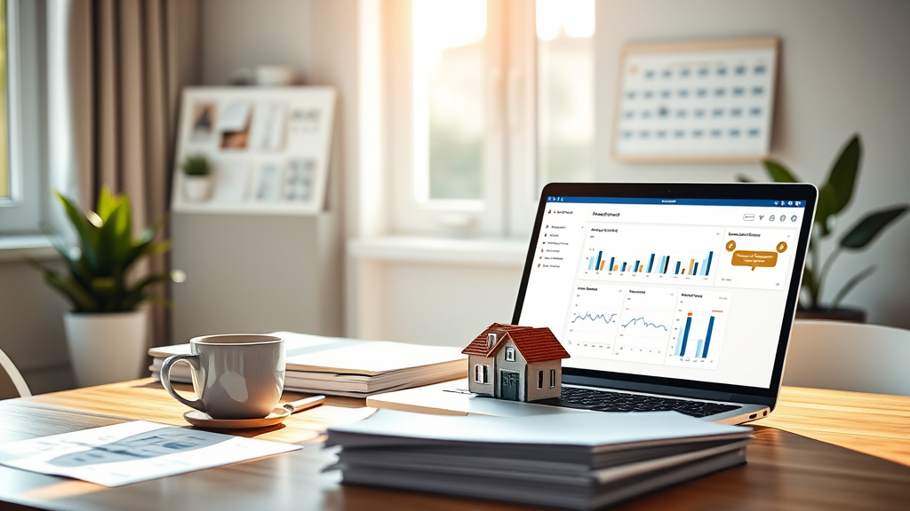

## Kira Takip Sistemi: Ev Sahipleri İçin En Uygun Zaman Ne Zaman?

Ev sahipliği veya emlak yatırımı yaparken, mülklerinizi ve kiracılarınızı takip etmek, hem zaman alıcı hem de hata yapma riskini artırır. Özellikle portföyünüz büyüdükçe, geleneksel yöntemler (örneğin Excel tabloları, not defterleri) yetersiz kalabilir. Bu nedenle, kira takip sistemine geçmek, hem işinizi kolaylaştırır hem de maliyetleri azaltır. İşte bu sistemle geçmenin en uygun zamanı ve neden bu an olmalı.

## Portföyünüz Büyüdüğünde Kira Takip Sistemi Gerekli Olur

Ev sahipleri, başlangıçta tek bir mülk ile başlarsa, ay başında banka hesabını kontrol etmek ve ödeme gelmediğinde kısa bir mesaj atmak gibi basit görevlerle yetinir. Ancak, portföyün büyümesiyle birlikte, her bir mülkün aidat durumu, sözleşme tarihi, bakım masrafları gibi detaylar, bir veri dağına dönüşebilir. Bu durumda, geleneksel yöntemlerle yönetmek, zaman kaybına ve hata yapmaya neden olur.

Kira takip sistemleri, verileri anlık olarak izlemenizi sağlar. Bu sistemler sayesinde, her mülkün durumu tek bir platformda toplanır. Böylece, her ay başı gibi bir kontrol yapmak zorunda kalmazsınız. Ayrıca, verilerin fiziksel olarak kaybolma ihtimali de sıfıra indirilir. Bu nedenle, portföyünüz büyüdüğünde, kira takip sistemine geçmek sadece faydalı değil, zorunlu hale gelir.

## Birden Fazla Kiracıyla İletişim Kurmak Zorlaşır

Bir mülk sahibi olarak, sadece bir kiracıyla değil, birden fazla kiracı ile iletişim kurmanız gerekebilir. Her bir kiracının iletişim tercihleri farklı olabilir. Kimi sadece mesajla, kimi ise telefonla iletişim kurmayı tercih edebilir. Bu durum, mülk sahibinin zamanını ciddi şekilde tüketebilir.

Profesyonel kira takip sistemleri, tüm iletişimleri tek bir merkezde toplar. Böylece, her kiracının beklentileri, ödeme alışkanlıkları ve iletişim tercihleri bir platformda görüntülenebilir. Bu, hem mülk sahibinin hem de kiracıların zamanlarını tasarruf eder. Ayrıca, ileride oluşabilecek anlaşmazlıklarda ispat sorunlarını da ortadan kaldırır.

## Kira Ödemelerinde Gecikmeler Arttıkça Sistem Gerekir

Kira ödemelerinde gecikmeler yaşanmaya başladığında, sistemdeki kontrol eksikliğine dair bir sinyal alınmış olur. Bu tür gecikmeler, hem mülk sahibinin hem de kiracının finansal dengesini bozabilir. Bu durumda, insan ilişkilerini bozmamak adına yapılan toleranslar, zamanla kötüye kullanılabilir.

Kira takip sistemleri, ödeme hatırlatmalarını otomatik olarak yapar. Bu sayede, mülk sahibinin kişisel müdahaleye gerek kalmadan, tahsilat oranlarını yükseltmesine olanak tanır. Ayrıca, gecikmeler yaşanmadan önce mekanizmalar devreye girerek, finansal disiplini baştan teşvik eder.

## Sıkça Sorulan Sorular

**Kira takip sistemi, portföy büyüdüğünde gerçekten gerekli mi?**
Evet, portföy büyüdükçe geleneksel yöntemler yetersiz kalır. Sistem, verileri tek bir platformda toplar ve her mülkün durumunu anlık olarak takip etmenizi sağlar.

**Bu sistemler, kiracı ile iletişim kurmayı nasıl kolaylaştırır?**
Profesyonel kira takip sistemleri, tüm kiracı ile iletişimleri tek bir merkezde toplar. Böylece, kiracıların beklentileri, ödeme alışkanlıkları ve iletişim tercihleri bir platformda görüntülenebilir.

**Kira ödemelerinde gecikmeler yaşandığında ne yapılmalı?**
Kira takip sistemleri, ödeme hatırlatmalarını otomatik olarak yapar. Bu sayede, mülk sahibinin kişisel müdahaleye gerek kalmadan, tahsilat oranlarını yükseltmesine olanak tanır.