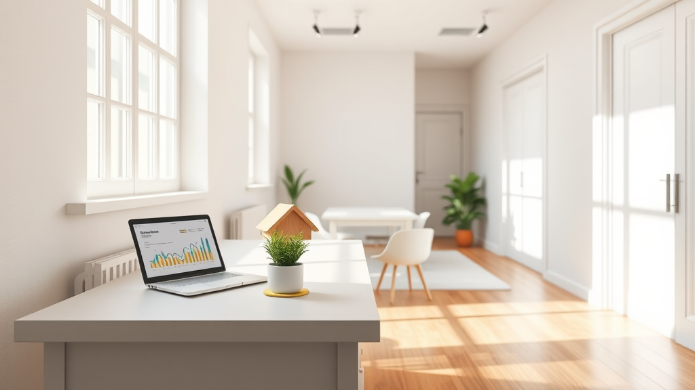

## Evi Yeni Kiracıya Hazırlamak Ne Kadar Vakit Alır?

Evi kiraya vermek süresi, ev sahipleri ve emlak yatırımcıları için çok kritik bir konudur. Eski kiracı ayrıldıktan sonra, evin yeniden kiraya verilmesi genellikle 1 ile 2 hafta arasında tamamlanır. Bu süreçte boyama, badana, tesisat onarımları ve detaylı temizlik gibi işler yapmak, evin kullanıma hazır hale gelmesini sağlar. Ancak, bu işlemleri planlı ve sıralı bir şekilde yapmazsanız, beklediğinizden daha uzun sürebilir.

Hasar tespiti yaparak onarım listesi oluşturmak, güvenilir ustalarla çalışmak ve profesyonel bir temizlik ekibiyle evi temizlemek, süreci hızlandırır. Bu adımları atarak, evinizi kiralama sürecinde rakiplerinizden öne çıkabilirsiniz. Evinizi düzenli ve dikkatli bir şekilde hazırlamak, hem mülkünüzü hem de kendi zamanınızı korumak açısından çok önemlidir. Ayrıca, evinize küçük onarımlar yapmak ve dekorasyonu güncellemek, yeni kiracıların ilgisini çekebilir.

## Doğru Kira Bedeli Belirlemek Süreci Nasıl Etkiler?

Evinin fiyatlandırması, kiralama süresini doğrudan etkileyen en önemli faktörlerden biridir. Piyasa gerçeklerinden uzak, aşırı yüksek fiyatlar, evin aylarca ilan sayfalarında beklemesine neden olabilir. Fiyatlandırma stratejisi, evin konumu, ulaşım imkanları ve bina yaşı gibi unsurlara göre belirlenmelidir. Gerçekçi bir fiyatla piyasaya çıkmak, kaliteli adayların ilgisini hemen çekebilir.

Uzun süre boş kalan bir dairenin yaratacağı gelir kaybı, ufak fiyat indirimlerinin getireceği zarardan çok daha fazladır. Dolayısıyla, piyasa analizini yaparak makul bir kira bedeli belirlemek, hem evinizi hızlıca kiraya vermek hem de gelirin kesilmesini önlemek açısından çok kritik bir adımdır. Evinizi doğru şekilde fiyatlandırarak, hem zaman kaybını hem de maddi zararı önleyebilirsiniz. Bu nedenle, kiralık ev pazarında arama yaparak, benzer özelliklere sahip evlerin fiyatlarını karşılaştırmanız faydalı olabilir.

## Görüntü Sunumu, Kiralama Sürecini Nasıl Hızlandırır?

Dijital çağda, ev arayışı tamamen internet üzerinden yapılır. Bu nedenle, ilan sitelerine eklediğiniz fotoğrafların kalitesi, evin ne kadar hızlı kiraya verileceğini doğrudan etkiler. Karanlık, dağınık veya evin mimarisini yansıtmayan fotoğraflar, adayların ilanı hızla geçmesine neden olur. Evinizi aydınlık saatlerde fotoğraflamak, odaların genişliğini net bir şekilde göstermek, kiralama hızını artırır.

Gerekirse sanal tur videoları eklemek, adayların evi uzaktan gezmesine olanak tanır. Bu tür görsel sunumlar, ilanın daha fazla tıklanmasını sağlar ve potansiyel adayların evi fiziksel olarak ziyaret etme isteğini artırır. Başarılı bir görsel sunum, kiralama sürecini günlerle ifade edilecek kadar kısaltır ve evinizi daha hızlı kiraya vermenizi sağlar. Ayrıca, ilanınızda evin avantajlarını net bir şekilde anlatmak da, potansiyel kiracıların ilgisini çekebilir.

## Sıkça Sorulan Sorular

**Evi yeni kiracıya vermek ne kadar sürer?**
Evi temizlik, boyama ve küçük onarımlarla hazırlamak 1 ile 2 hafta arasında tamamlanabilir.

**Doğru kira bedeli belirlemek neden önemlidir?**
Doğru fiyatlandırma, evin hızlıca kiraya verilmesini ve gelir kaybını önler.

**Görsel sunum kiralama sürecini nasıl etkiler?**
Kaliteli fotoğraflar ve sanal tur videoları, ilanın daha fazla tıklanmasını sağlar ve kiralama süresini kısaltır.