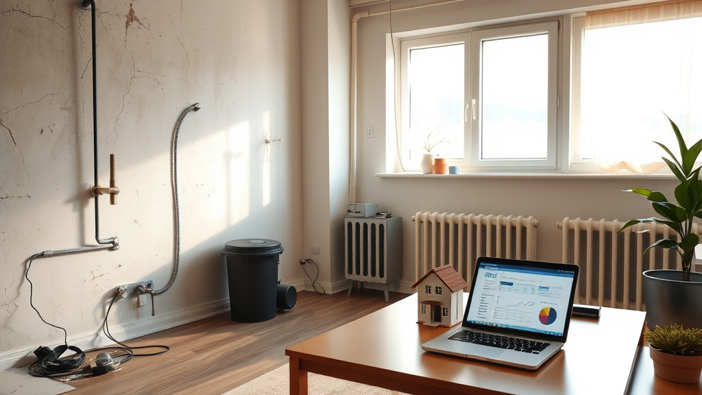

## Pasif gelir ev sahipliği mi zahmet mi?

Pasif gelir ev sahipliği, sadece kira geliri almakla kalmaz. Gerçek hayatta, kiracı bulmak, gelir vergisi ödemek, su ve elektrik aboneliklerini yönetmek gibi pek çok görevle karşı karşıya kalabilirsiniz. Bu nedenle pasif gelir ev sahipliği gerçekten mi mümkün sorusuna verilecek cevap, sadece kira gelirini değil, tüm ilgili masrafları da dikkate alarak değerlendirilmelidir. Yatırımcılar, ev sahipliğinin sadece gelir getireceğini düşünerek girişimde bulunurken, beklenmedik masraflar ve zaman kayıpları ile karşılaşabilirler. Bu durum, pasif gelirin temel prensibi olan "zahmetsizlik"i bozabilir. İşte ev sahipliğinin "pasif" olmadığını anlamak için dikkat etmeniz gereken noktalar.

## Kira geliri elde ederken hangi masraflar ortaya çıkar?

Kira geliri, sadece kiracıdan alınan bedelden ibaret değildir. Bir evin sahibi olarak, gelir vergisi, deprem sigortası, bina demirbaş giderleri, bakım onarım masrafları ve kiracı ile ilgili diğer maliyetlerle de uğraşmak zorundasınız. Beklenmedik arızalar, örneğin su borularının patlaması veya kombinin bozulması, sadece bir ayın gelirini sıfıra indirebilir. Kiracı tahliyesi sonrası evi yeni bir kiracıya hazırlamak da ekstra maliyetler doğurabilir. Bu nedenle, pasif gelirin elde edilmesi için, bu tür masraflara dikkatli bir şekilde hazırlanmak gerekir. Özellikle birden fazla mülkün sahibi olan yatırımcılar, bu tür masrafları yönetmek için profesyonel bir mülk yönetim hizmetinden faydalanabilir. Aksi takdirde, beklenmedik bir arıza ya da kiracı bulma süreci, yıllık gelirinizi ciddi ölçüde etkileyebilir.

## Kiracı ile iletişim süreci ne kadar zaman alır?

Kiracı ile iletişim süreci, sadece kira tahsilatı ile sınırlı kalmaz. Kiracıların zamanında ödeme yapmaması, evdeki sorunlar, komşulukla yaşanan anlaşmazlıklar ve diğer birçok konu, sahibin zamanını büyük oranda alabilir. Özellikle birden fazla mülkün sahibi olan kişiler, bu süreçte kendilerini tam zamanlı bir müşteri temsilcisi gibi hissedebilir. Zamanın ve enerjinin bu şekilde harcanması, pasif gelirin temel prensibi olan "zahmetsizlik"i bozar. Bu nedenle, ev sahipliğinin zorluklarını aşmak, profesyonel bir mülk yönetimine ihtiyaç duymaktan başka bir yolu yoktur. Ayrıca, teknolojik çözümler ile iletişim süreçlerini otomatikleştirmek, yatırımcıya hem zaman kazandırır hem de stres azaltır. Bu tür sistemler, kiracı bulma, ödeme takibi, bakım talepleri gibi süreçleri otomatikleştirebilir. Böylece, ev sahipliği, gerçekten "pasif" hale gelebilir.

## Sıkça Sorulan Sorular

**1. Pasif gelir ev sahipliği mi?**
Evet, ancak sadece kira gelirini değil, aynı zamanda masrafları ve zaman kaybını da dikkate alarak değerlendirilmelidir. Profesyonel mülk yönetimi ile bu zorluklar azaltılabilir.

**2. Ev sahipliği yorucu bir iş mi?**
Evet, özellikle kendiniz mülkünüzü yönetiyorsanız. Ancak, dijital araçlar ve profesyonel mülk yönetimi hizmetleri sayesinde bu yorgunluk büyük ölçüde azaltılabilir.

**3. Boş evler yatırımcıya zarar verir mi?**
Evet, boş evler sadece gelir kaybına değil, aidat, ısınma ve abonelik gibi sabit masraflara da neden olabilir. Bu durum, yıllık kar marjını ciddi şekilde düşürebilir.