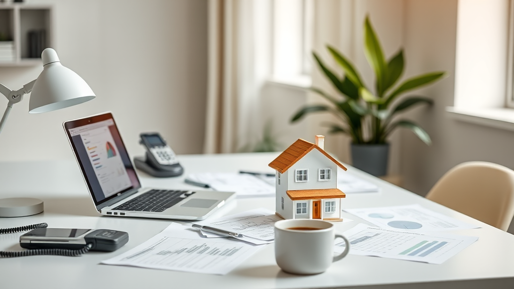

## Sosyal konut başvuru iadeleri nedir?

Sosyal konut başvuru iadeleri, İstanbul'daki 100 bin sosyal konut projesi kapsamında başvuruların değerlendirilmesi ve gerekli kontrollerin ardından yapılan bir işlemdir. Bu süreç, hem ev sahipleri hem de emlak yatırımcıları için önemli bir dönüm noktasıdır. Özellikle düşük gelirli ailelerin ve sosyal kalkınma hedeflerine yönelik geliştirilen bu projelerde, başvuruların reddedilmesi durumunda, iade süreci başvurunun ne şekilde işlediğini ve neden reddedildiğini anlamak açısından kritik bir adımdır.

Bu tür iadeler, genellikle başvurunun tamamlanmasının ardından belirli bir süre sonra yapılır. Süre, başvuru sayısına ve projenin karmaşıklığına göre değişebilir. Emlak yatırımcıları ve ev sahipleri, bu süreçte dikkatli olmalı ve iade süreçlerini takip etmeli. Ayrıca, iade sürecinde elde edilen bilgiler, gelecekteki başvurular için önemli bir kılavuz olabilir.

## Sosyal konut başvuru iadeleri nasıl yapılır?

Sosyal konut başvuru iadeleri, genellikle elektronik ortamda yapılır. Bu süreç, hem pratik hem de şeffaf bir yapıya sahiptir. Ancak, bazı başvuruların reddedilmesi durumunda, neden reddedildiğinin anlaşılması ve gerekirse düzeltilmesi gerekebilir. Bu nedenle, iade sürecindeki detaylara dikkat etmek önemlidir.

İade süreci, genellikle başvuru formunun doldurulması, belge toplama, sistemde değerlendirme ve ardından iade kararının verilmesi aşamalarını içerir. Bu süreçte, başvurunun reddedilmesi durumunda, emlak yatırımcıları ve ev sahipleri, neden reddedildiği hakkında bilgi alabilmektedir. Bu bilgiler, gelecekteki başvuru stratejilerini şekillendirmek açısından değerlidir.

## Sosyal konut başvuru iadeleri ev sahipleri ve yatırımcılar için ne anlama gelir?

Sosyal konut başvuru iadeleri, hem ev sahipleri hem de emlak yatırımcıları için önemli bir refleksiyon fırsatı sunar. Bu süreç, başvurunun reddedilmesi durumunda, neden reddedildiği hakkında bilgi edinilmesini sağlar. Bu bilgiler, gelecekteki başvuruların daha etkili yapılmasına yardımcı olur.

Ayrıca, sosyal konut projelerindeki başvuru iadeleri, emlak yatırımcılarının yatırım stratejilerini gözden geçirmesini ve gerekirse değişiklikler yapmalarını sağlar. Bu tür projelerde, yatırım yaparken dikkat edilmesi gereken birçok detay vardır. Bu nedenle, başvuru iadeleri süreci, yatırımcıların yatırım kararlarını daha bilinçli hale getirir.

## Sıkça Sorulan Sorular

**Sosyal konut başvuruları iade edilir mi?**
Evet, bazı durumlarda başvuru iade edilebilir. Bu durumlar, başvuru formunun eksikliği, belgelerin eksikliği veya diğer teknik sebeplerle olabilir.

**Başvuru iade edildiğinde ne yapılır?**
Başvuru iade edildiğinde, emlak yatırımcıları ve ev sahipleri, iade sebebini öğrenmeli ve gerekirse düzeltilmesi gereken yerleri kontrol etmelidir.

**Sosyal konut başvuruları ne kadar sürede iade edilir?**
Sosyal konut başvurularının iade edilmesi süresi, başvuru sayısına ve projenin karmaşıklığına göre değişebilir. Genellikle birkaç hafta ile birkaç ay arasında değişir.